<h1> README </h1>

<h2> R7: App Purpose. </h2>

 This app is designed to solve the problem of getting rid of those old mugs that are building up in your kitchen as well as provide a specialised market for those mug collectors. 

<h2> R8: Problem. </h2>

 A common issue most household have is collecting unnecessary items. Mugs are one of the sneakiest items that can accumulate without you ever noticing. This app can solve this issue by helping clear up that space or on the other side help you get that perfect mug that you will use every morning. 

#
<h2>R9/10: Application and Github. </h2>

[Link: Mean Mugging](https://staging-mean-mugging.herokuapp.com/)

[Github](https://github.com/patjd0/PatrickDanenas_T2A2)

#
<h2> R11: Description. </h2>

Purpose: 
- Mean Mugging is a market designed to help people buy and sell mugs.

Features: 
- View listings: Any user can view a listing they can see the listing name, description, price and category and image. In order to purchase a mug the user must be registered and signed in.

- Create a new listing: When a user is signed in they are able to create a listing, write a description, set a price, choose a category and upload an image.

- Register/Login: When registering you must enter an email address, username and enter a passwords that is at least 6 characters long.

- View sold orders: If you are logged in you are able to view the items you have sold with much the same info you had provided at the time of the purchase. 

- View bought items: When logged in you are able to see your previous purchases with the same data given to you at time of purchase. 

#
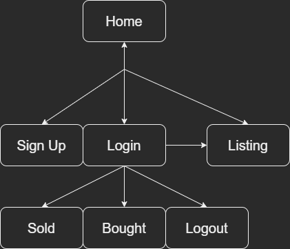
#

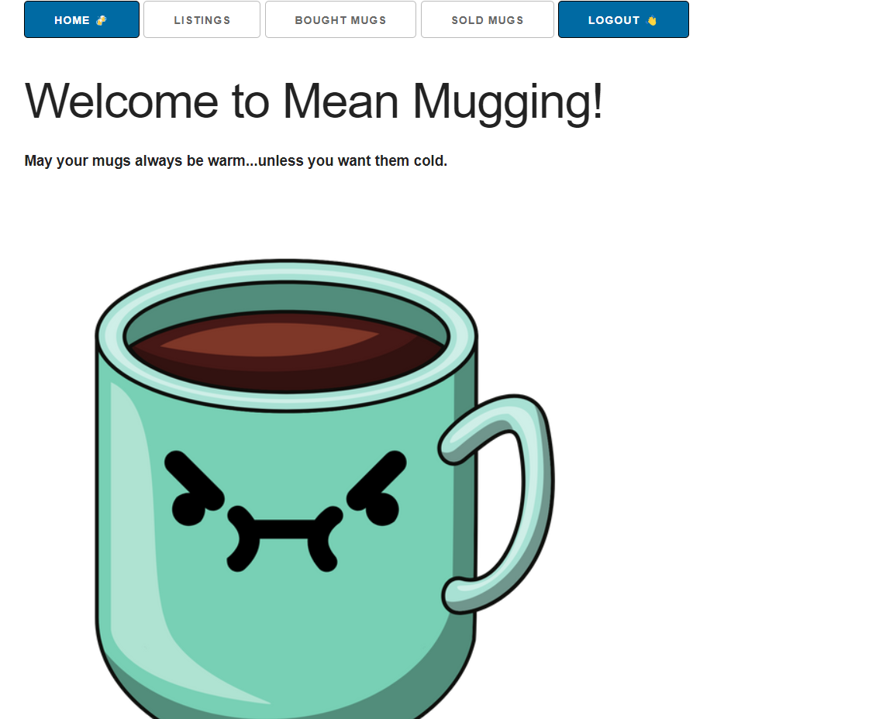
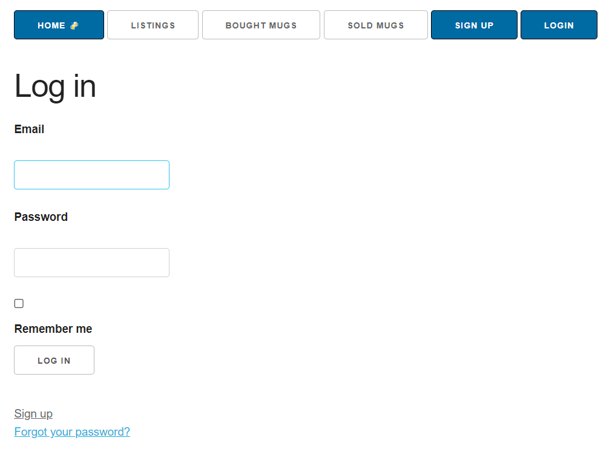
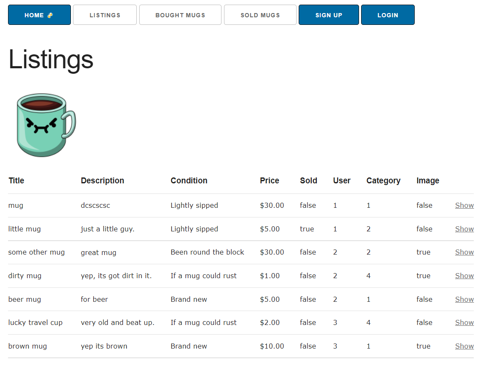
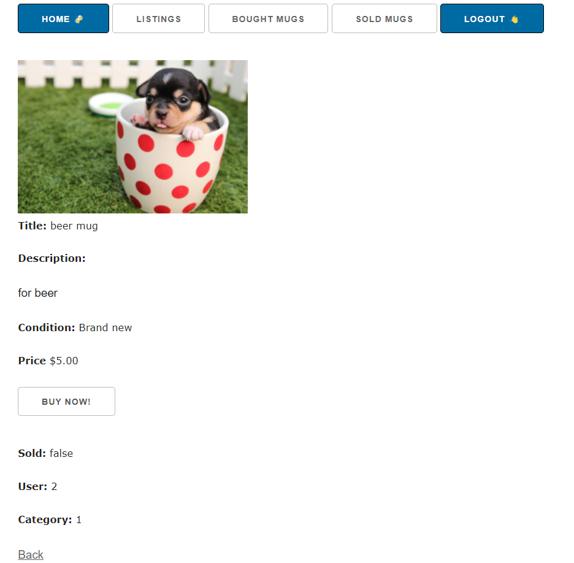
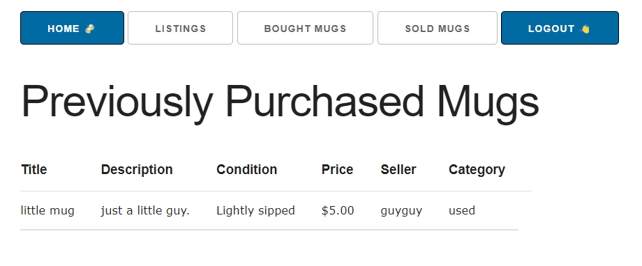

#
<h2> Audience: </h2>

 The targetted audience of this market is coffee and tea drinkers australia wide but including all other mugs like travel and beer mugs as well. 

<h2> Tech Stack: </h2>

- Ruby '3.1.1'
- Ruby on Rails '6.1.6'
- HTML
- CSS
- JavaScript
- imgBB
- Heroku
# 
<h2>R12: User Stories. </h2>

<b>Home Page:</b> 
As a user, I would like to view the home page after logging in to get an overview of the app.

<i>Requirements:</i>

- Logged in user can sign out.
- Logged in users can view bought mugs.
- Logged in users can view sold mugs.
- Any user can access listings.
- Any user can view the Home page.

<b>Sign Up:</b> As a user, I would like to make purchases and sell items on the listings page.

<i>Requirements:</i>
- Enter name.
- Enter username.
- Enter password. (6 characters minimum)
- Confirm password.

<b>Listing Page:</b> 
 As a user, I would like to view the listings to see what is available.

<i>Requirements:</i>
- Any user can access listings.
- Any user can view listings.
- Logged in users can create a listing.
- Logged in users can delete their listings.
- Logged in users can edit their listings.

<b> View Listing:</b>
As a user, I would like to view a listings from the listing page.

<i>Requirements:</i>
- Any user can view listings.
- Logged in users can make a purchase.
- Logged in users can edit their listings.

<b> View Bought and Sold Mugs:</b>
As a user, I would like to view my purchase and selling history.

<i>Requirements:</i>
- Must be logged in.

#
<h2>R13: Wireframes. </h2>

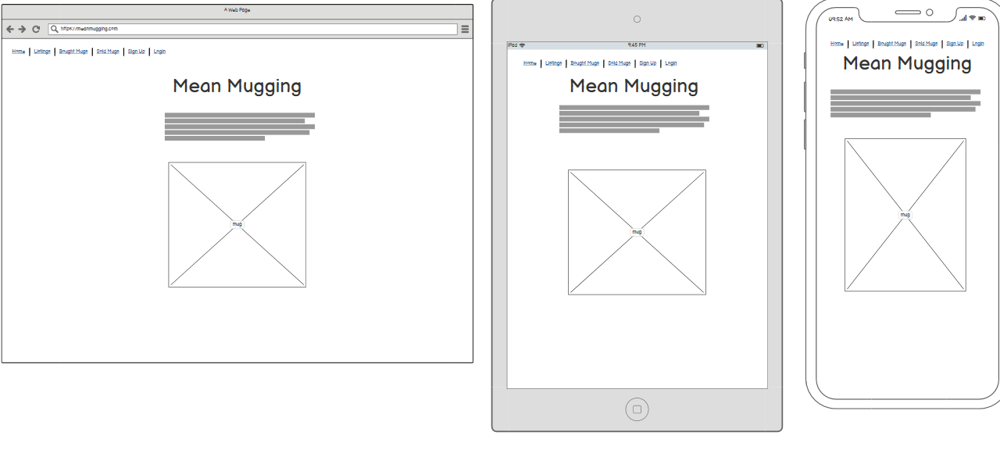
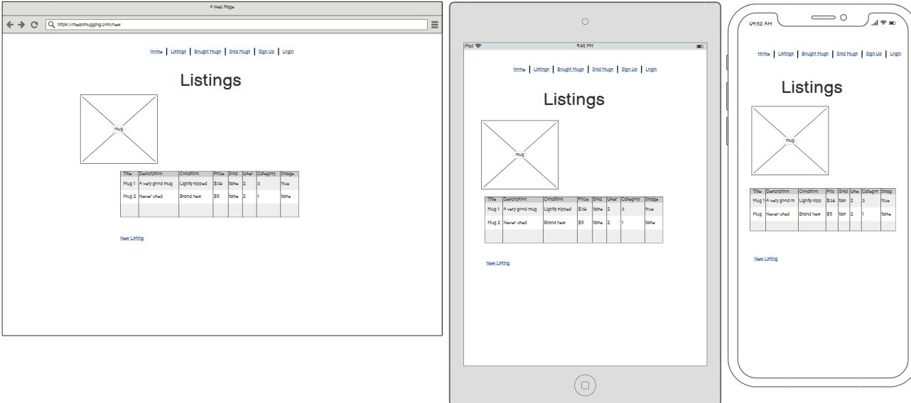
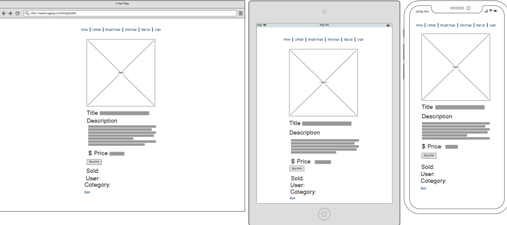
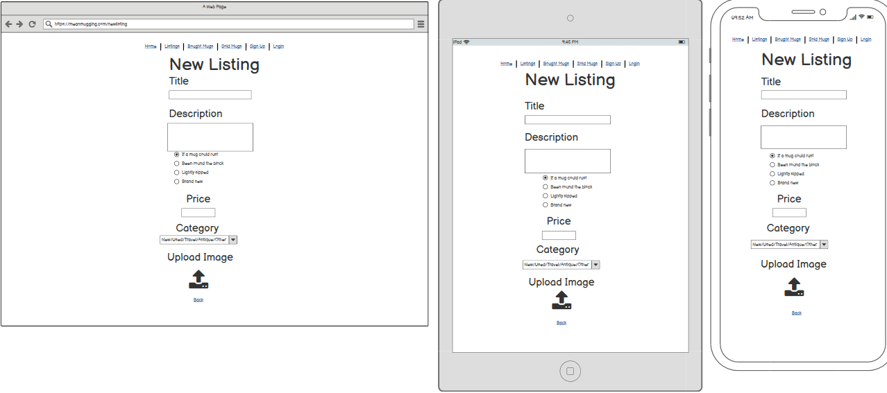
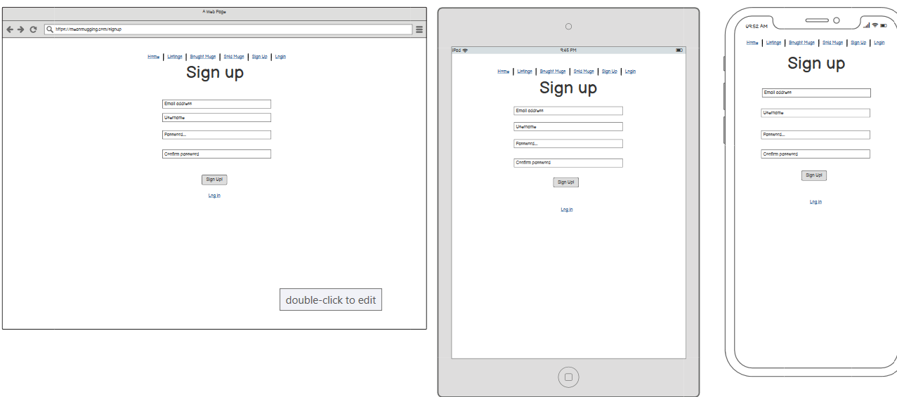
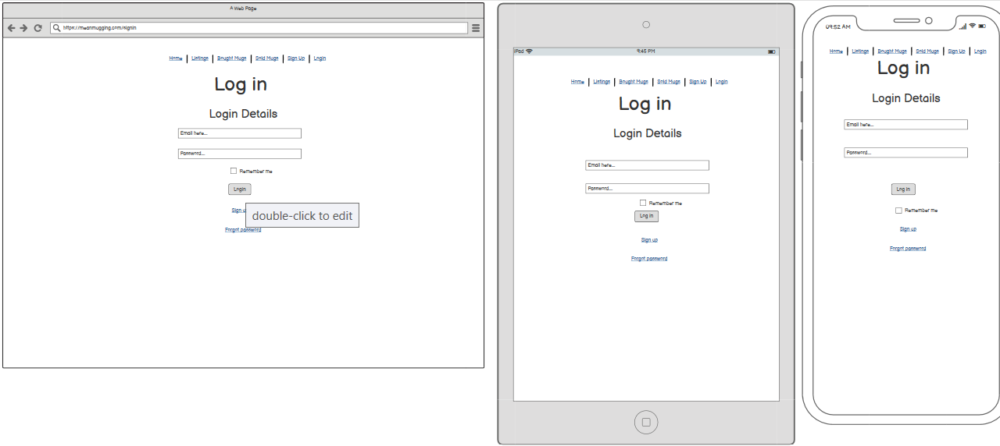
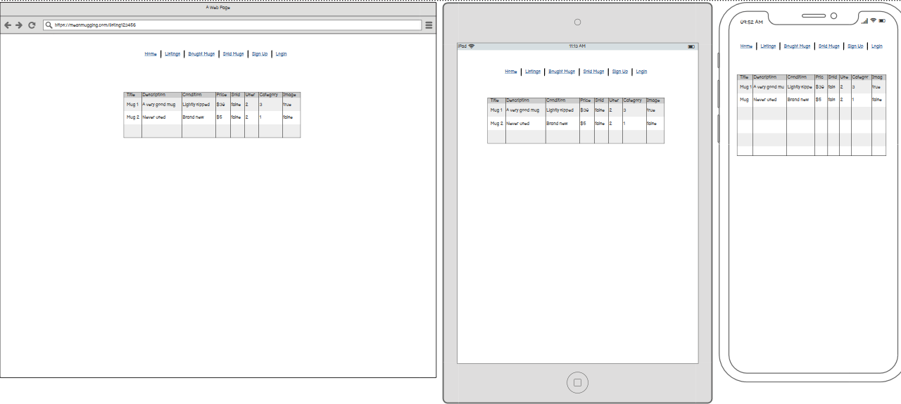
#
<h2>R14: ERD </h2>

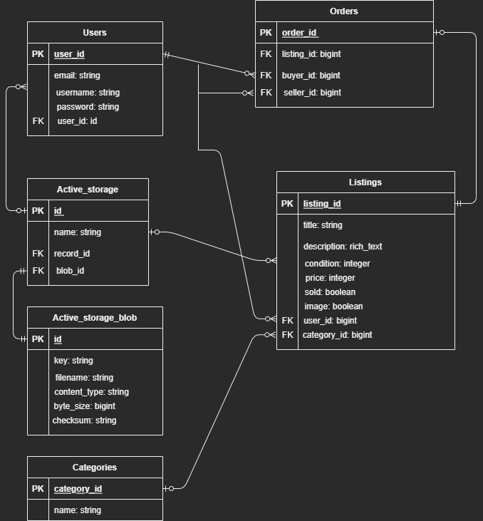
#

<h2>R15: Different High-Level Components. </h2>

<b> Navbar:</b>

The navbar is the most used components in the app for it is on every page and is crucial to navigating the application.

<b>Forms:</b>

This component works much like the table component with more user interaction and is used in a variety of places across the app such as sign up, sign in, create and edit a listing.

<b>Tables:</b> 

In order to display all listing information tables were the best choice component for the task. These tables are used all over the app on pages such as listings, sold and bought mugs and viewing a listing.
#

<h2>R16: Third Party Services. </h2>
<b> Devise: </b>

Devise is a key part of my app as it is used for registration and authentication. Devise is a third party service and is considered a cornerstone gem for Rails applications. Devise's modules can be found in your application "app/models/user.rb".
#

<h2>R17: Projects Model Relationships. </h2> 

<b>Users:</b>
 - The users model is referenced by the Listings and Orders model for the user id, and connects it to buyers and sellers. In the ERD this shows a user can have multiple listings, sold and bought items.

<b>Categories:</b>
 - Categories model connects to the listing model category_id.

<b>Listings:</b>
- Listings reference the user_id and category_id. This association states a listing belongs to a user and a category.

<b>Orders:</b>
- Orders belong to listings, buyers and sellers. A Foreign key is used for buyers and sellers from the user class.

<h2>R18: Database Relations. </h2>

<b>Users:</b>
- Users have a relationship with listings, and orders. This presents the ability to create no listings or many listings. This is parrallel with orders as the user has the same abilities.

<b>Listings:</b> 
- When a user creates a listing it is a one to one relationship, for that listing belongs to that user. Listings have an optional to one relation with orders and categories, The ERD best visualises these tables with foreign keys for category_id and user_id.

<b>Categories:</b>
- A category can belong to none or many listings with an
option to many relation with the listings table.

<b>Orders:</b>
- The order table in the ERD references the listing_id, buyer_id and seller_id foreign keys. In this table orders have a one to one relation with users, but order can only belong to one user as well one listing. 

---

<h2>R19: Database Schema design: </h2>

 
ActiveRecord::Schema.define(version: 2022_07_19_043145) do

   <b>These are extensions that must be enabled in order to support this database
  enable_extension "plpgsql" </b>

create_table "action_text_rich_texts", force: :cascade do |t|

    t.string "name", null: false
    t.text "body"
    t.string "record_type", null: false
    t.bigint "record_id", null: false
    t.datetime "created_at", precision: 6, null: false
    t.datetime "updated_at", precision: 6, null: false
    t.index ["record_type", "record_id", "name"], name: "index_action_text_rich_texts_uniqueness", unique: true
    end

  
create_table "active_storage_attachments", force: :cascade do |t|

    t.string "name", null: false
    t.string "record_type", null: false
    t.bigint "record_id", null: false
    t.bigint "blob_id", null: false
    t.datetime "created_at", null: false
    t.index ["blob_id"], name: "index_active_storage_attachments_on_blob_id"
    t.index ["record_type", "record_id", "name", "blob_id"], name: "index_active_storage_attachments_uniqueness", unique: true
    end

  
create_table "active_storage_blobs", force: :cascade do |t|

    t.string "key", null: false
    t.string "filename", null: false
    t.string "content_type"
    t.text "metadata"
    t.string "service_name", null: false
    t.bigint "byte_size", null: false
    t.string "checksum", null: false
    t.datetime "created_at", null: false
    t.index ["key"], name: "index_active_storage_blobs_on_key", unique: true
    end

  
create_table "active_storage_variant_records", force: :cascade do |t|

    t.bigint "blob_id", null: false
    t.string "variation_digest", null: false
    t.index ["blob_id", "variation_digest"], name: "index_active_storage_variant_records_uniqueness", unique: true
    end

create_table "categories", force: :cascade do |t|

    t.string "name"
    t.datetime "created_at", precision: 6, null: false
    t.datetime "updated_at", precision: 6, null: false
    end
  
create_table "listings", force: :cascade do |t|

    t.string "title"
    t.integer "condition"
    t.integer "price"
    t.boolean "sold", default: false
    t.bigint "user_id", null: false
    t.bigint "category_id", null: false
    t.datetime "created_at", precision: 6, null: false
    t.datetime "updated_at", precision: 6, null: false
    t.index ["category_id"], name: "index_listings_on_category_id"
    t.index ["user_id"], name: "index_listings_on_user_id"
    end
  
create_table "orders", force: :cascade do |t|

    t.bigint "listing_id", null: false
    t.bigint "buyer_id", null: false
    t.bigint "seller_id", null: false
    t.datetime "created_at", precision: 6, null: false
    t.datetime "updated_at", precision: 6, null: false
    t.index ["buyer_id"], name: "index_orders_on_buyer_id"
    t.index ["listing_id"], name: "index_orders_on_listing_id"
    t.index ["seller_id"], name: "index_orders_on_seller_id"
     end

  
create_table "users", force: :cascade do |t|

    t.string "email", default: "", null: false
    t.string "encrypted_password", default: "", null: false
    t.string "reset_password_token"
    t.datetime "reset_password_sent_at"
    t.datetime "remember_created_at"
    t.string "username"
    t.datetime "created_at", precision: 6, null: false
    t.datetime "updated_at", precision: 6, null: false
    t.index ["email"], name: "index_users_on_email", unique: true
    t.index ["reset_password_token"], name: "index_users_on_reset_password_token", unique: true
    end 

    add_foreign_key "active_storage_attachments", "active_storage_blobs", column: "blob_id"
    add_foreign_key "active_storage_variant_records", "active_storage_blobs", column: "blob_id"
    add_foreign_key "listings", "categories"
    dd_foreign_key "listings", "users"
    add_foreign_key "orders", "listings"
    add_foreign_key "orders", "users", column: "buyer_id"
    add_foreign_key "orders", "users", column: "seller_id"
    end
---

<h2>R20: How Tasks are Allocated and Tracked. </h2>

- Using five columns on a trello board was essential in managing the build of this application. Trello's easy to look at and friendly user interface makes it a fantastic tool in any projects development process. For this project specifically the task details were weighed by the cards themselves as the columns were fairly simple. 
- The first column was marked definitions and gave a colour labelling system for each card to include its priority and roughly how much time the task should take.
- The second column was Backlog, this is where all application ideas would go that have not yet been started or were waiting on other implementations first.
- The third column was to do. These tasks had all been started or were at a place that i could start at anytime, again the priority of the task usually factored in to what would be done first.
- In progress was the fourth column. This is self explanatory and serves helpful when taking a break or walking away for extended periods. This column also is a good indicator to not start to many tasks at a time.
- Complete is the final column and is the graveyard of all finished tasks.   

#

[Trello](https://trello.com/b/TfWK7vI3/t2a2-mean-mugging-market)

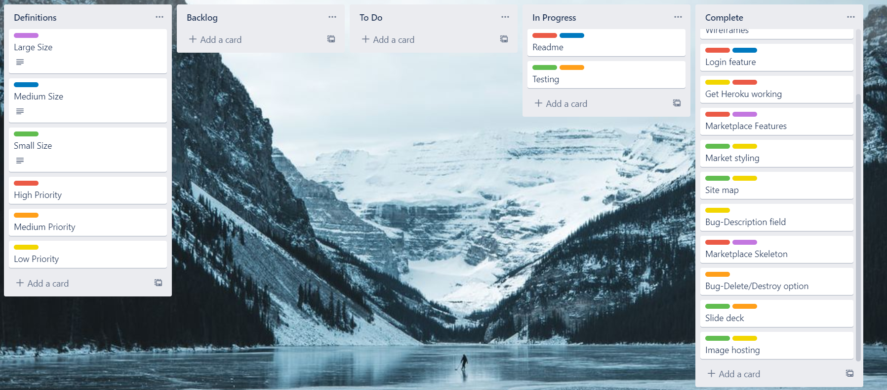

#

    Ruby version 3.1.1
    rails 6.1.6

